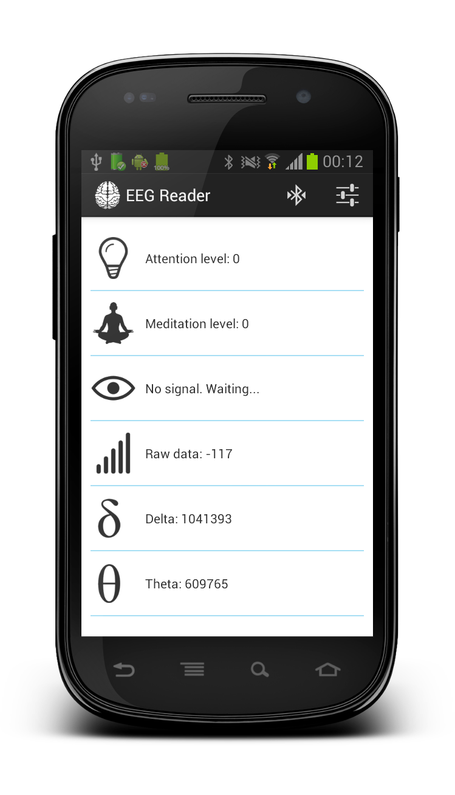

EEG Reader
===============

EEG Reader is a boilerplate project for object-oriented mobile Android applications using NeuroSky Mobile device.
This application is able to connect to NeuroSky Mobile device via Bluetooth and read: 
* attention level
* meditation level
* blink level
* raw data
* brainwaves: delta, theta, low alpha, high alpha, low beta, high beta, low gamma, mid gamma

Screenshots
===============

